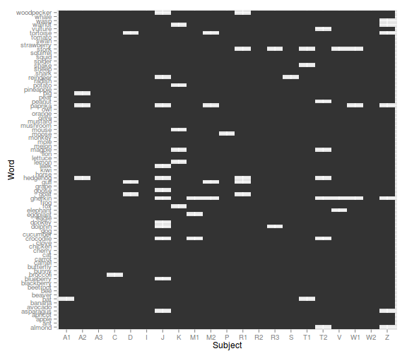
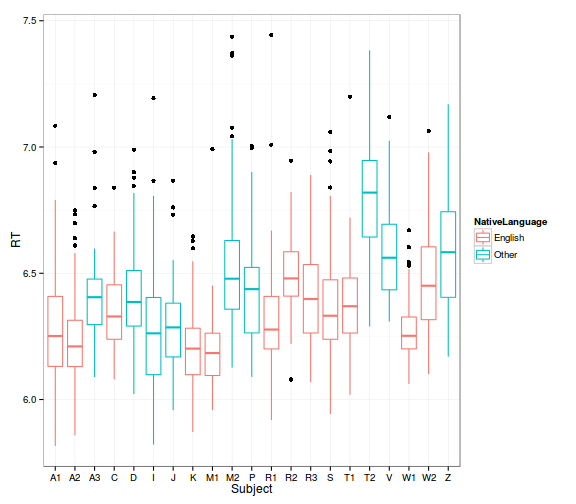
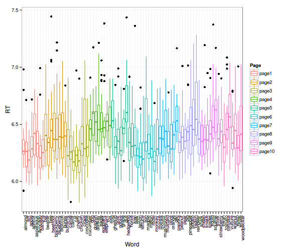
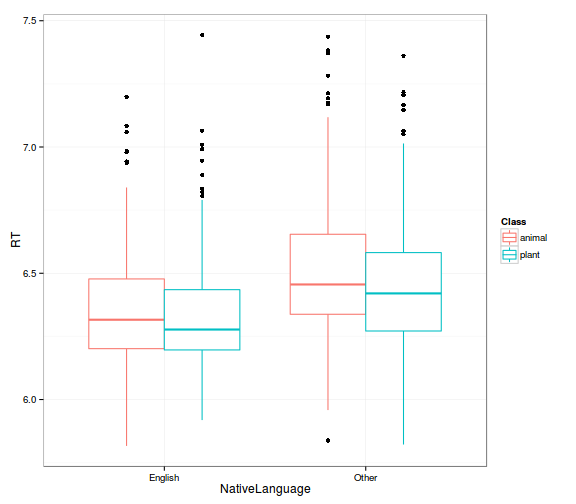
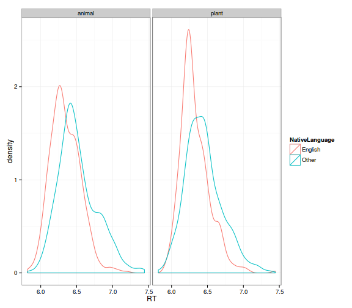
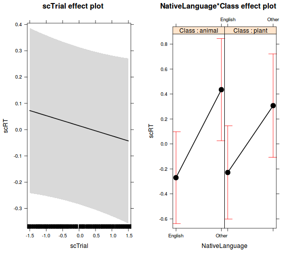

# Adatexploráció, ábrázolás 


## A kísérleti dizájn vizsgálata, leíró statisztikák
- elvileg keresztezett random hatásaink vannak: minden személynek minden szót bemutattak, pontosan egyszer

```r
freq <- with(lexdec, table(Subject, Word))
# a freq mátrix túl nagy, a példához elég egy kis részlete
freq[1:5, 1:5]
```

```
##        Word
## Subject almond ant apple apricot asparagus
##      A1      1   1     1       1         1
##      A2      1   1     1       1         1
##      A3      1   1     1       1         1
##      C       1   1     1       1         1
##      D       1   1     1       1         1
```

```r
# tökéletesen keresztezett, ismétlés nélküli dizájn
table(freq)
```

```
## freq
##    1 
## 1659
```

- létrehoztunk egy beágyazott hatást is: a szavak a szótár egy-egy oldaláról származnak

```r
with(lexdec, table(Word, Page))
```

```
##             Page
## Word         page1 page2 page3 page4 page5 page6 page7 page8 page9 page10
##   almond        21     0     0     0     0     0     0     0     0      0
##   ant           21     0     0     0     0     0     0     0     0      0
##   apple         21     0     0     0     0     0     0     0     0      0
##   apricot       21     0     0     0     0     0     0     0     0      0
##   asparagus     21     0     0     0     0     0     0     0     0      0
##   avocado       21     0     0     0     0     0     0     0     0      0
##   banana        21     0     0     0     0     0     0     0     0      0
##   bat           21     0     0     0     0     0     0     0     0      0
##   beaver         0    21     0     0     0     0     0     0     0      0
##   bee            0    21     0     0     0     0     0     0     0      0
##   beetroot       0    21     0     0     0     0     0     0     0      0
##   blackberry     0    21     0     0     0     0     0     0     0      0
##   blueberry      0    21     0     0     0     0     0     0     0      0
##   broccoli       0    21     0     0     0     0     0     0     0      0
##   bunny          0    21     0     0     0     0     0     0     0      0
##   butterfly      0    21     0     0     0     0     0     0     0      0
##   camel          0     0    21     0     0     0     0     0     0      0
##   carrot         0     0    21     0     0     0     0     0     0      0
##   cat            0     0    21     0     0     0     0     0     0      0
##   cherry         0     0    21     0     0     0     0     0     0      0
##   chicken        0     0    21     0     0     0     0     0     0      0
##   clove          0     0    21     0     0     0     0     0     0      0
##   crocodile      0     0    21     0     0     0     0     0     0      0
##   cucumber       0     0    21     0     0     0     0     0     0      0
##   dog            0     0     0    21     0     0     0     0     0      0
##   dolphin        0     0     0    21     0     0     0     0     0      0
##   donkey         0     0     0    21     0     0     0     0     0      0
##   eagle          0     0     0    21     0     0     0     0     0      0
##   eggplant       0     0     0    21     0     0     0     0     0      0
##   elephant       0     0     0    21     0     0     0     0     0      0
##   fox            0     0     0    21     0     0     0     0     0      0
##   frog           0     0     0    21     0     0     0     0     0      0
##   gherkin        0     0     0     0    21     0     0     0     0      0
##   goat           0     0     0     0    21     0     0     0     0      0
##   goose          0     0     0     0    21     0     0     0     0      0
##   grape          0     0     0     0    21     0     0     0     0      0
##   gull           0     0     0     0    21     0     0     0     0      0
##   hedgehog       0     0     0     0    21     0     0     0     0      0
##   horse          0     0     0     0    21     0     0     0     0      0
##   kiwi           0     0     0     0    21     0     0     0     0      0
##   leek           0     0     0     0     0    21     0     0     0      0
##   lemon          0     0     0     0     0    21     0     0     0      0
##   lettuce        0     0     0     0     0    21     0     0     0      0
##   lion           0     0     0     0     0    21     0     0     0      0
##   magpie         0     0     0     0     0    21     0     0     0      0
##   melon          0     0     0     0     0    21     0     0     0      0
##   mole           0     0     0     0     0    21     0     0     0      0
##   monkey         0     0     0     0     0    21     0     0     0      0
##   moose          0     0     0     0     0     0    21     0     0      0
##   mouse          0     0     0     0     0     0    21     0     0      0
##   mushroom       0     0     0     0     0     0    21     0     0      0
##   mustard        0     0     0     0     0     0    21     0     0      0
##   olive          0     0     0     0     0     0    21     0     0      0
##   orange         0     0     0     0     0     0    21     0     0      0
##   owl            0     0     0     0     0     0    21     0     0      0
##   paprika        0     0     0     0     0     0    21     0     0      0
##   peanut         0     0     0     0     0     0     0    21     0      0
##   pear           0     0     0     0     0     0     0    21     0      0
##   pig            0     0     0     0     0     0     0    21     0      0
##   pineapple      0     0     0     0     0     0     0    21     0      0
##   potato         0     0     0     0     0     0     0    21     0      0
##   radish         0     0     0     0     0     0     0    21     0      0
##   reindeer       0     0     0     0     0     0     0    21     0      0
##   shark          0     0     0     0     0     0     0    21     0      0
##   sheep          0     0     0     0     0     0     0     0    21      0
##   snake          0     0     0     0     0     0     0     0    21      0
##   spider         0     0     0     0     0     0     0     0    21      0
##   squid          0     0     0     0     0     0     0     0    21      0
##   squirrel       0     0     0     0     0     0     0     0    21      0
##   stork          0     0     0     0     0     0     0     0    21      0
##   strawberry     0     0     0     0     0     0     0     0    21      0
##   swan           0     0     0     0     0     0     0     0    21      0
##   tomato         0     0     0     0     0     0     0     0     0     21
##   tortoise       0     0     0     0     0     0     0     0     0     21
##   vulture        0     0     0     0     0     0     0     0     0     21
##   walnut         0     0     0     0     0     0     0     0     0     21
##   wasp           0     0     0     0     0     0     0     0     0     21
##   whale          0     0     0     0     0     0     0     0     0     21
##   woodpecker     0     0     0     0     0     0     0     0     0     21
```

Fontos, hogy sose kódoljunk úgy változókat, hogy ne legyen egyértelmű, hogy keresztezett vagy beágyazott hatásokról van-e szó. Magyarán ha hierarchikus változóink vannak (pl. személy << iskola, vagy jelen példában szó << szótári oldal),
akkor az alsóbb szinten is alkalmazzunk egyedi azonosítókat. Jelen példánál maradva,
ahol minden szótári oldalról 8-8 szó szerepel, hiba lenne a szavakat "word1",
"word2", "word3", ..., "word8"-ként kódolni, hiszen az egyik oldal "word1" 
szavának semmi köze nincsen a másik oldal "word1" szavához. 

```r
# tegyük fel, hogy a Word változót word1, word2, ... word8-ként kódoltuk
# a Page minden szintjén
lexdec$WordWrong <- paste0(
    "word", 
    as.integer(lexdec$Word) - 8*(as.integer(lexdec$Page)-1))

# innentől a keresztgyakorisági tábla nem mutatja meg, hogy
# a 'word' faktor a 'page' faktorunkba van ágyazva
with(lexdec, table(WordWrong, Page))
```

```
##          Page
## WordWrong page1 page2 page3 page4 page5 page6 page7 page8 page9 page10
##     word1    21    21    21    21    21    21    21    21    21     21
##     word2    21    21    21    21    21    21    21    21    21     21
##     word3    21    21    21    21    21    21    21    21    21     21
##     word4    21    21    21    21    21    21    21    21    21     21
##     word5    21    21    21    21    21    21    21    21    21     21
##     word6    21    21    21    21    21    21    21    21    21     21
##     word7    21    21    21    21    21    21    21    21    21     21
##     word8    21    21    21    21    21    21    21    21    21      0
```

- csak a helyes válaszokat akarjuk elemezni: szűrjük le az adatokat és
válasszuk ki a releváns változókat

```r
lexdec_corr <- subset(lexdec, Correct == "correct",
                      select = c(Subject, RT, Trial, NativeLanguage, 
                                 Word, Class, Page))
```

- kérjünk leíró statisztikákat a kérdéses változókra (a _psych_ csomagot fogom használni, de egyebet is lehetne)

```r
# általános leíró statisztikák
summary(lexdec_corr)
```

```
##     Subject           RT            Trial       NativeLanguage
##  A3     :  79   Min.   :5.816   Min.   : 23.0   English:920   
##  I      :  79   1st Qu.:6.227   1st Qu.: 64.0   Other  :674   
##  R2     :  79   Median :6.364   Median :106.0                 
##  W2     :  79   Mean   :6.397   Mean   :104.9                 
##  A1     :  78   3rd Qu.:6.526   3rd Qu.:146.0                 
##  C      :  78   Max.   :7.444   Max.   :185.0                 
##  (Other):1122                                                 
##       Word         Class          Page    
##  ant    :  21   animal:884   page2  :166  
##  apple  :  21   plant :710   page3  :165  
##  apricot:  21                page6  :164  
##  avocado:  21                page8  :163  
##  banana :  21                page1  :162  
##  beaver :  21                page4  :162  
##  (Other):1468                (Other):612
```

```r
# példa: válaszidők statisztikái szavanként, ferdeségi mutatóval
with(lexdec_corr, psych::describeBy(RT, Subject, skew = TRUE))
```

```
## group: A1
##   vars  n    mean        sd   median  trimmed      mad      min     max
## 1    1 78 6.29445 0.2371747 6.251629 6.275394 0.196216 5.816334 7.08423
##      range      skew  kurtosis         se
## 1 1.267896 0.8520839 0.7785435 0.02685475
## -------------------------------------------------------- 
## group: A2
##   vars  n     mean        sd   median  trimmed       mad      min      max
## 1    1 76 6.241644 0.1812018 6.210338 6.226239 0.1322974 5.859236 6.749907
##      range      skew  kurtosis         se
## 1 0.890671 0.8430157 0.7210964 0.02078528
## -------------------------------------------------------- 
## group: A3
##   vars  n     mean       sd   median  trimmed       mad      min     max
## 1    1 79 6.411508 0.174746 6.405334 6.397683 0.1537506 6.089654 7.20633
##      range     skew kurtosis         se
## 1 1.116676 1.585181 5.124337 0.01966046
## -------------------------------------------------------- 
## group: C
##   vars  n     mean       sd   median  trimmed       mad      min      max
## 1    1 78 6.336761 0.153622 6.328853 6.333675 0.1715731 6.079752 6.839127
##       range      skew   kurtosis         se
## 1 0.7593749 0.4114168 0.02946384 0.01739427
## -------------------------------------------------------- 
## group: D
##   vars  n    mean        sd   median  trimmed       mad      min      max
## 1    1 76 6.42303 0.2006718 6.386154 6.406292 0.1645523 6.021854 6.989496
##       range      skew kurtosis         se
## 1 0.9676422 0.7265388 0.407637 0.02301863
## -------------------------------------------------------- 
## group: I
##   vars  n     mean        sd   median  trimmed       mad      min      max
## 1    1 79 6.266895 0.2313842 6.262087 6.250492 0.2156946 5.821799 7.193265
##      range      skew kurtosis         se
## 1 1.371466 0.9771252 2.260001 0.02603276
## -------------------------------------------------------- 
## group: J
##   vars  n     mean        sd   median  trimmed       mad      min      max
## 1    1 67 6.293374 0.1738307 6.285565 6.282037 0.1597834 5.958208 6.866369
##       range      skew kurtosis        se
## 1 0.9081612 0.8146107 1.120534 0.0212368
## -------------------------------------------------------- 
## group: K
##   vars  n     mean        sd   median  trimmed       mad      min      max
## 1    1 73 6.213245 0.1679288 6.201764 6.200523 0.1496421 5.871196 6.645689
##       range      skew   kurtosis         se
## 1 0.7744929 0.5962026 0.01302904 0.01965457
## -------------------------------------------------------- 
## group: M1
##   vars  n     mean        sd median  trimmed       mad      min      max
## 1    1 76 6.189777 0.1489886  6.184 6.179755 0.1240525 5.958208 6.991805
##      range     skew kurtosis         se
## 1 1.033596 1.971881 8.960611 0.01709017
## -------------------------------------------------------- 
## group: M2
##   vars  n     mean        sd   median  trimmed       mad      min      max
## 1    1 75 6.534821 0.2842884 6.478462 6.502254 0.2075407 6.126521 7.436621
##    range     skew kurtosis        se
## 1 1.3101 1.169999 1.369175 0.0328268
## -------------------------------------------------------- 
## group: P
##   vars  n     mean        sd   median  trimmed     mad      min      max
## 1    1 78 6.435114 0.2028893 6.437196 6.417274 0.18803 6.090088 7.003854
##       range      skew  kurtosis         se
## 1 0.9137665 0.7444783 0.2491568 0.02297269
## -------------------------------------------------------- 
## group: R1
##   vars  n     mean        sd   median  trimmed       mad      min      max
## 1    1 74 6.321197 0.2096948 6.277186 6.296668 0.1251596 5.918769 7.443722
##      range     skew kurtosis         se
## 1 1.524954 2.513418 10.28148 0.02437652
## -------------------------------------------------------- 
## group: R2
##   vars  n     mean        sd   median  trimmed       mad      min      max
## 1    1 79 6.486008 0.1487251 6.479719 6.484601 0.1409063 6.079392 6.945922
##       range      skew  kurtosis         se
## 1 0.8665307 0.1315091 0.4415866 0.01673288
## -------------------------------------------------------- 
## group: R3
##   vars  n     mean        sd   median  trimmed       mad      min      max
## 1    1 77 6.407649 0.1910904 6.398014 6.402558 0.2024326 6.068556 6.889455
##       range     skew   kurtosis         se
## 1 0.8208992 0.285513 -0.7359847 0.02177678
## -------------------------------------------------------- 
## group: S
##   vars  n     mean        sd   median trimmed       mad      min      max
## 1    1 78 6.388921 0.2227348 6.331799 6.37157 0.1885148 5.942303 7.058474
##      range      skew  kurtosis         se
## 1 1.116171 0.8178309 0.4936526 0.02521975
## -------------------------------------------------------- 
## group: T1
##   vars  n     mean        sd   median trimmed       mad      min      max
## 1    1 76 6.378826 0.1838232 6.369693 6.36946 0.1618263 6.018996 7.199115
##      range     skew kurtosis         se
## 1 1.180119 1.106364 3.542694 0.02108597
## -------------------------------------------------------- 
## group: T2
##   vars  n     mean        sd  median  trimmed       mad      min      max
## 1    1 72 6.803464 0.2281968 6.81935 6.800709 0.2415011 6.289565 7.382824
##      range       skew   kurtosis         se
## 1 1.093259 0.08222496 -0.3742787 0.02689325
## -------------------------------------------------------- 
## group: V
##   vars  n     mean        sd   median  trimmed       mad      min      max
## 1    1 76 6.586475 0.1856749 6.561587 6.575127 0.1947326 6.308967 7.117976
##       range      skew   kurtosis         se
## 1 0.8090095 0.5560653 -0.3809575 0.02129837
## -------------------------------------------------------- 
## group: W1
##   vars  n     mean        sd   median  trimmed        mad      min
## 1    1 76 6.272456 0.1251487 6.252294 6.260596 0.08296481 6.062139
##        max     range      skew  kurtosis         se
## 1 6.669786 0.6076469 0.9484034 0.7339698 0.01435554
## -------------------------------------------------------- 
## group: W2
##   vars  n    mean        sd  median  trimmed       mad      min      max
## 1    1 79 6.47424 0.2011546 6.45066 6.465565 0.2086125 6.100586 7.064089
##       range     skew   kurtosis         se
## 1 0.9635033 0.498012 0.01056057 0.02263167
## -------------------------------------------------------- 
## group: Z
##   vars  n     mean        sd   median  trimmed       mad      min     max
## 1    1 72 6.598258 0.2370327 6.583337 6.585071 0.2574446 6.170266 7.16909
##      range      skew   kurtosis         se
## 1 0.998824 0.4364043 -0.5002696 0.02793457
```

## Ábrázolás

A következőkben ggplot ábrákkal megvizsgáljuk, hogy milyen a hiányzó adatok
mintázata, illetve hogyan alakul a válaszidők eloszlása különböző csoportosító
szempontok alapján.

- hiányzó adatok (amiatt, hogy csak a helyes válaszokat elemezzük):

```r
library(ggplot2)
ggplot(lexdec_corr, aes(x = Subject, y = Word)) + 
    geom_tile()
```

 

- válaszidők személyenként:

```r
# Subject
ggplot(lexdec_corr, aes(x = Subject, y = RT, col = NativeLanguage)) + 
    geom_boxplot() + 
    theme_bw()
```

 

- válaszidők szavanként és oldalanként

```r
# Page & Word
ggplot(lexdec_corr, aes(x = Word, y = RT, col = Page)) + 
    geom_boxplot() + 
    theme_bw() + 
    theme(axis.text.x = element_text(angle = 90, hjust = 1))
```

 

- válaszidők eloszlása az anyanyelv és az ingerosztály (állat/növény) függvényében

```r
# Class & NativeLanguage (boxplot)
ggplot(lexdec_corr, aes(x = NativeLanguage, y = RT, col = Class)) + 
    geom_boxplot() + 
    theme_bw()
```

 

```r
# Class & NativeLanguage (density)
ggplot(lexdec_corr, aes(x = RT, col = NativeLanguage)) + 
    geom_density() + 
    facet_wrap(~ Class) + 
    theme_bw()
```

 

- a Trial változó hatása

```r
# Trial
ggplot(lexdec_corr, aes(x = Trial, y = RT)) + 
    geom_point() + 
    stat_smooth(method = "lm") + 
    facet_wrap(~Subject) + 
    theme_bw()
```

 


## Adatok előkészítése

- ha lennének egyértelmű outlierek, azokat érdemes az elemzés előtt kiszűrni
- standardizálhatjuk a folytonos változókat

```r
lexdec_corr[, c("scRT", "scTrial")] <- scale(lexdec_corr[, c("RT", "Trial")])
```

- az elemzési céljainktól függ, de érdemes lehet átállítani a kontrasztokat (az R alapból treatment-kontrasztot használ)

```r
op <- options(contrasts = c("contr.sum", "contr.poly"))
```


