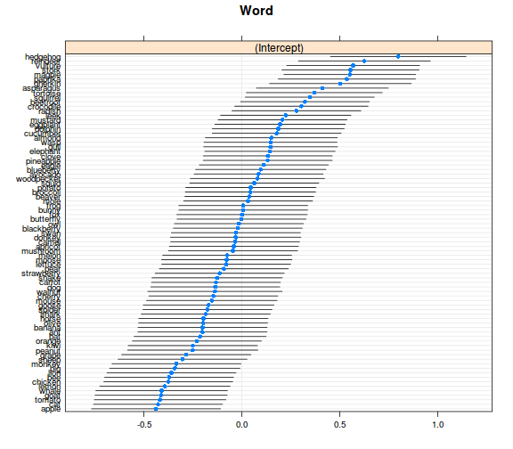
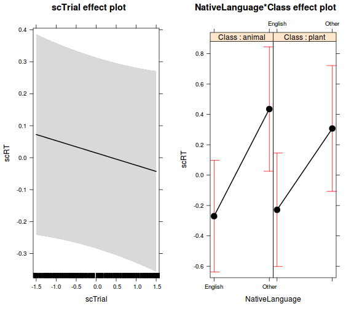

# Modellépítés / modellszelekció


- optimális eset: elméletvezérelt modellépítés
- gyakoribb eset: adatvezérelt modellépítés
- döntési pontok: fix hatások és random hatások, random hatáson belül random konstans és random slope -> kevés változó esetén is nagyon komplex lehet!

### Javaslatok
- inkább haladjunk a bővebb modell felől
- először random hatások, utána fix hatások tesztelése
- a random hatásoknál érdemes a maximális struktúrát megtartani (feltéve, hogy konvergál) 
- a random hatásokat REML, a fix hatásokat ML becsléssel teszteljük (a végső modell paramétereit REML becsléssel számoljuk)
- a modellszelekció történhet likelihoodarány-teszttel vagy pl. AIC-értékek összevetésével
- ha két fix hatás interakciója szerepel a modellben, akkor mindig vegyük be a főhatásokat is, illetve szerepeltessük az interakciót a random struktúrában is


### Példa
#### Egy lehetséges induló modell
- modellezzük a válaszidőt (RT) a próba sorszáma (scTrial) és a személy anyanyelve, illetve a szó szemantikai kategóriája alapján 

```r
( model_full <- lmer(scRT ~ scTrial + NativeLanguage*Class + 
                         (1 + scTrial | Subject) + 
                         (1 | Page) + (1 | Word), 
                     data = lexdec_corr) )
```

```
## Linear mixed model fit by REML ['lmerMod']
## Formula: 
## scRT ~ scTrial + NativeLanguage * Class + (1 + scTrial | Subject) +  
##     (1 | Page) + (1 | Word)
##    Data: lexdec_corr
## REML criterion at convergence: 3573.958
## Random effects:
##  Groups   Name        Std.Dev. Corr 
##  Word     (Intercept) 0.3278        
##  Subject  (Intercept) 0.5310        
##           scTrial     0.1266   -0.41
##  Page     (Intercept) 0.2846        
##  Residual             0.6831        
## Number of obs: 1594, groups:  Word, 79; Subject, 21; Page, 10
## Fixed Effects:
##                    (Intercept)                         scTrial  
##                       -0.28836                        -0.03841  
##            NativeLanguageOther                      Classplant  
##                        0.74844                         0.04091  
## NativeLanguageOther:Classplant  
##                       -0.17005
```

- örök FAQ: miért nem számol az lmer p-értékeket?: [ezért](https://stat.ethz.ch/pipermail/r-help/2006-May/094765.html)

- az lmer outputja a regressziós modellek outputjának formátumát követi; mit tegyünk, ha mi ANOVA-stílusú táblázatot szeretnénk?

```r
library(car)
Anova(model_full)
```

```
## Analysis of Deviance Table (Type II Wald chisquare tests)
## 
## Response: scRT
##                       Chisq Df Pr(>Chisq)   
## scTrial              1.3803  1   0.240055   
## NativeLanguage       9.0170  1   0.002675 **
## Class                0.1232  1   0.725551   
## NativeLanguage:Class 5.9001  1   0.015140 * 
## ---
## Signif. codes:  0 '***' 0.001 '**' 0.01 '*' 0.05 '.' 0.1 ' ' 1
```

```r
Anova(model_full, test.statistic = "F")
```

```
## Note: method with signature 'sparseMatrix#ANY' chosen for function 'kronecker',
##  target signature 'dgCMatrix#ngCMatrix'.
##  "ANY#sparseMatrix" would also be valid
```

```
## Analysis of Deviance Table (Type II Wald F tests with Kenward-Roger df)
## 
## Response: scRT
##                           F Df  Df.res  Pr(>F)  
## scTrial              1.3798  1   19.86 0.25403  
## NativeLanguage       8.1579  1   19.02 0.01010 *
## Class                0.1214  1   71.94 0.72853  
## NativeLanguage:Class 5.8946  1 1482.69 0.01531 *
## ---
## Signif. codes:  0 '***' 0.001 '**' 0.01 '*' 0.05 '.' 0.1 ' ' 1
```

```r
# az SPSS és SAS a Type III felbontást részesítik előnyben
Anova(model_full, type = 3)
```

```
## Analysis of Deviance Table (Type III Wald chisquare tests)
## 
## Response: scRT
##                        Chisq Df Pr(>Chisq)    
## (Intercept)           2.4452  1  0.1178872    
## scTrial               1.3803  1  0.2400554    
## NativeLanguage       11.0466  1  0.0008885 ***
## Class                 0.1936  1  0.6599082    
## NativeLanguage:Class  5.9001  1  0.0151402 *  
## ---
## Signif. codes:  0 '***' 0.001 '**' 0.01 '*' 0.05 '.' 0.1 ' ' 1
```

- egyéb csomagok p-értékek korrekt kinyerésére: [afex](https://cran.r-project.org/web/packages/afex/index.html), [lmerTest](https://cran.r-project.org/web/packages/lmerTest/index.html)

#### Random hatások tesztelése
- elsősorban akkor szükséges, ha túl komplex az induló modell, és/vagy szélsőséges értékek szerepelnek a varianca-kovariancia mátrixban (pl. 1 vagy -1 közeli korreláció és/vagy 0 szórás)
- az `anova.merMod` függvény használható, de valószínűleg túl konzervatív (szélsőséges esetben akár 2-szerese a p-érték a valósnak)
- használhatjuk az AIC (vagy BIC) kritériumot is

```r
# modellek illesztése
( model_r1 <- lmer(scRT ~ scTrial + NativeLanguage*Class + 
                       (1 | Subject) + (0 + scTrial | Subject) + 
                       (1 | Page ) + (1 | Word), 
                   data = lexdec_corr) )
```

```
## Linear mixed model fit by REML ['lmerMod']
## Formula: scRT ~ scTrial + NativeLanguage * Class + (1 | Subject) + (0 +  
##     scTrial | Subject) + (1 | Page) + (1 | Word)
##    Data: lexdec_corr
## REML criterion at convergence: 3576.323
## Random effects:
##  Groups    Name        Std.Dev.
##  Word      (Intercept) 0.3274  
##  Subject   scTrial     0.1263  
##  Subject.1 (Intercept) 0.5322  
##  Page      (Intercept) 0.2849  
##  Residual              0.6831  
## Number of obs: 1594, groups:  Word, 79; Subject, 21; Page, 10
## Fixed Effects:
##                    (Intercept)                         scTrial  
##                        -0.2701                         -0.0385  
##            NativeLanguageOther                      Classplant  
##                         0.7052                          0.0416  
## NativeLanguageOther:Classplant  
##                        -0.1696
```

```r
( model_r2 <- lmer(scRT ~ scTrial + NativeLanguage*Class + 
                       (1 | Subject) + (1 | Page ) + (1 | Word), 
                   data = lexdec_corr) )
```

```
## Linear mixed model fit by REML ['lmerMod']
## Formula: scRT ~ scTrial + NativeLanguage * Class + (1 | Subject) + (1 |  
##     Page) + (1 | Word)
##    Data: lexdec_corr
## REML criterion at convergence: 3599.746
## Random effects:
##  Groups   Name        Std.Dev.
##  Word     (Intercept) 0.3265  
##  Subject  (Intercept) 0.5319  
##  Page     (Intercept) 0.2869  
##  Residual             0.6942  
## Number of obs: 1594, groups:  Word, 79; Subject, 21; Page, 10
## Fixed Effects:
##                    (Intercept)                         scTrial  
##                       -0.27083                        -0.03727  
##            NativeLanguageOther                      Classplant  
##                        0.70558                         0.04608  
## NativeLanguageOther:Classplant  
##                       -0.18058
```

```r
( model_r3 <- lmer(scRT ~ scTrial + NativeLanguage*Class + 
                       (1 | Subject) + (1 | Page ), 
                   data = lexdec_corr) )
```

```
## Linear mixed model fit by REML ['lmerMod']
## Formula: scRT ~ scTrial + NativeLanguage * Class + (1 | Subject) + (1 |  
##     Page)
##    Data: lexdec_corr
## REML criterion at convergence: 3749.47
## Random effects:
##  Groups   Name        Std.Dev.
##  Subject  (Intercept) 0.5286  
##  Page     (Intercept) 0.3100  
##  Residual             0.7557  
## Number of obs: 1594, groups:  Subject, 21; Page, 10
## Fixed Effects:
##                    (Intercept)                         scTrial  
##                       -0.28877                        -0.03508  
##            NativeLanguageOther                      Classplant  
##                        0.69806                         0.07262  
## NativeLanguageOther:Classplant  
##                       -0.18751
```

```r
# modellek összevetése
anova(model_r3, model_r2, model_r1, model_full, refit = FALSE)
```

```
## Data: lexdec_corr
## Models:
## model_r3: scRT ~ scTrial + NativeLanguage * Class + (1 | Subject) + (1 | 
## model_r3:     Page)
## model_r2: scRT ~ scTrial + NativeLanguage * Class + (1 | Subject) + (1 | 
## model_r2:     Page) + (1 | Word)
## model_r1: scRT ~ scTrial + NativeLanguage * Class + (1 | Subject) + (0 + 
## model_r1:     scTrial | Subject) + (1 | Page) + (1 | Word)
## model_full: scRT ~ scTrial + NativeLanguage * Class + (1 + scTrial | Subject) + 
## model_full:     (1 | Page) + (1 | Word)
##            Df    AIC    BIC  logLik deviance   Chisq Chi Df Pr(>Chisq)    
## model_r3    8 3765.5 3808.5 -1874.7   3749.5                              
## model_r2    9 3617.7 3666.1 -1799.9   3599.7 149.724      1    < 2e-16 ***
## model_r1   10 3596.3 3650.1 -1788.2   3576.3  23.423      1    1.3e-06 ***
## model_full 11 3596.0 3655.1 -1787.0   3574.0   2.365      1     0.1241    
## ---
## Signif. codes:  0 '***' 0.001 '**' 0.01 '*' 0.05 '.' 0.1 ' ' 1
```

```r
# AIC
AIC(model_r3, model_r2, model_r1, model_full)
```

```
##            df      AIC
## model_r3    8 3765.470
## model_r2    9 3617.746
## model_r1   10 3596.323
## model_full 11 3595.958
```

```r
# BIC
BIC(model_r3, model_r2, model_r1, model_full)
```

```
##            df      BIC
## model_r3    8 3808.462
## model_r2    9 3666.112
## model_r1   10 3650.063
## model_full 11 3655.072
```

#### Random hatások ellenőrzése
- BLUP (best linear unbiased predictor) -> Douglas Bates inkább a "conditional mode of random effects" megfogalmazást preferálja
- a legjobb, ha a feltételes variancia-kovariancia mátrixot is kérjük, de ez többtagú random hatásoknál egyelőre nem működik

```r
ranefs <- ranef(model_r1, condVar = TRUE)
```

```
## Warning in ranef.merMod(model_r1, condVar = TRUE): conditional variances
## not currently available via ranef when there are multiple terms per factor
```

```r
library(lattice) # az ábrázoláshoz betöltjük a lattice csomagot
dotplot(ranefs)
```

```
## $Word
```

 

```
## 
## $Subject
```

 

```
## 
## $Page
```

 

```r
# ennél a modellnél stimmel a dolog
ranefs_vcov <- ranef(model_r2, condVar = TRUE)
dotplot(ranefs_vcov)
```

```
## $Word
```

 

```
## 
## $Subject
```

 

```
## 
## $Page
```

 
- összességében azt látjuk, hogy a random hatások valóban számottevő mértékűek
- ellenőrizzük a reziduálisokat (normál eloszlásúak-e, van-e szélsőséges érték):

```r
resids <- scale(residuals(model_r1))
par(mfrow = c(1, 2))
hist(resids)  # sima hisztogram
qqnorm(resids)  # Q-Q ábra a normalitás ellenőrzésére
qqline(resids)
```

 
- a reziduálisok alapján megfontolandó lenne, hogy a válaszidők logaritmusa helyett azok inverz transzformáltjával számoljunk, vagy esetleg zárjuk ki azokat az eseteket, amelyeknél a standardizált reziduális túllép egy bizonyos értéket (pl. 2,5-öt)
- válasszuk ki a végső modellt

```r
model_ranef_final <- model_r1
```


#### Fix hatások tesztelése
- a legkényelmesebb módszer: best subset; FIGYELEM, ésszel használjuk!!!
- mivel most a fix hatásokat teszteljük, sima ML becslést (nem pedig REML-t) kell alkalmazni

```r
library(MuMIn)
options(na.action = "na.fail") # ez kell, különben a dredge fv. panaszkodik

# Alapesetben az ML megoldható az update() függvénnyel
model_ranef_final_ml <- update(model_ranef_final, REML = FALSE)

# Modellek illesztése
( fixmodels <- dredge(model_ranef_final_ml) )
```

```
## Fixed term is "(Intercept)"
```

```
## Global model call: lmer(formula = scRT ~ scTrial + NativeLanguage * Class + (1 | 
##     Subject) + (0 + scTrial | Subject) + (1 | Page) + (1 | Word), 
##     data = lexdec_corr, REML = FALSE)
## ---
## Model selection table 
##    (Int)    Cls NtL scT      Cls:NtL df logLik    AICc   delta weight
## 12 -0.26930 +   +            +        9 -1781.578 3581.3 0.00  0.364 
## 16 -0.26960 +   +   -0.03846 +       10 -1780.872 3581.9 0.61  0.268 
## 3  -0.25140     +                     7 -1784.564 3583.2 1.93  0.139 
## 7  -0.25120     +   -0.03836          8 -1783.873 3583.8 2.57  0.101 
## 4  -0.23720 +   +                     8 -1784.498 3585.1 3.82  0.054 
## 8  -0.23740 +   +   -0.03826          9 -1783.811 3585.7 4.47  0.039 
## 1   0.01855                           6 -1787.815 3587.7 6.41  0.015 
## 5   0.01856         -0.03839          7 -1787.122 3588.3 7.04  0.011 
## 2   0.03267 +                         7 -1787.750 3589.6 8.30  0.006 
## 6   0.03227 +       -0.03828          8 -1787.060 3590.2 8.94  0.004 
## Models ranked by AICc(x) 
## Random terms (all models): 
## '1 | Subject', '0 + scTrial | Subject', '1 | Page', '1 | Word'
```
- az eredmények azt mutatják, hogy a Trial változónk hatása nem szignifikáns, és erősen határeset a Class főhatása és a NativaLanguage X Class interakció is
- tegyuk fel, hogy az scTrial-t kontrollváltozóként mindenképpen szerepeltetni akarjuk, és kérjük a BIC kritériumot is

```r
( fixmodels2 <- dredge(model_ranef_final_ml, 
                       rank = "AIC", extra = "BIC", fix = "scTrial") )
```

```
## Fixed terms are "scTrial" and "(Intercept)"
```

```
## Global model call: lmer(formula = scRT ~ scTrial + NativeLanguage * Class + (1 | 
##     Subject) + (0 + scTrial | Subject) + (1 | Page) + (1 | Word), 
##     data = lexdec_corr, REML = FALSE)
## ---
## Model selection table 
##   (Int)    Cls NtL scT      Cls:NtL BIC  df logLik    AIC    delta weight
## 8 -0.26960 +   +   -0.03846 +       3635 10 -1780.872 3581.7 0.00  0.639 
## 3 -0.25120     +   -0.03836         3627  8 -1783.873 3583.7 2.00  0.235 
## 4 -0.23740 +   +   -0.03826         3634  9 -1783.811 3585.6 3.88  0.092 
## 1  0.01856         -0.03839         3626  7 -1787.122 3588.2 6.50  0.025 
## 2  0.03227 +       -0.03828         3633  8 -1787.060 3590.1 8.38  0.010 
## Models ranked by AIC(x) 
## Random terms (all models): 
## '1 | Subject', '0 + scTrial | Subject', '1 | Page', '1 | Word'
```


#### Fix hatások ábrázolása
- az effects package mindenféle modellre (köztük a merMod modellekre is) tud ábrát készíteni

```r
library(effects)
effs <- allEffects(model_ranef_final)
plot(effs)
```

```
## Loading required package: grid
## Loading required package: colorspace
## 
## Attaching package: 'effects'
## 
## The following object is masked from 'package:car':
## 
##     Prestige
```

 

